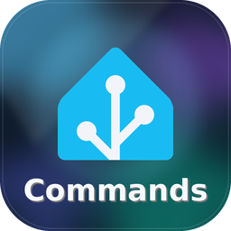
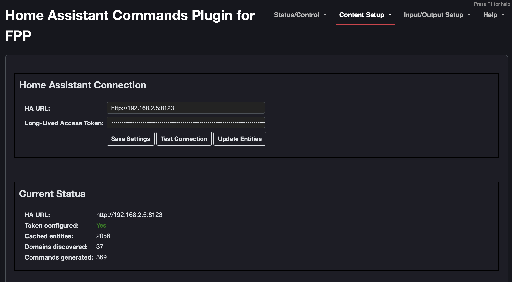
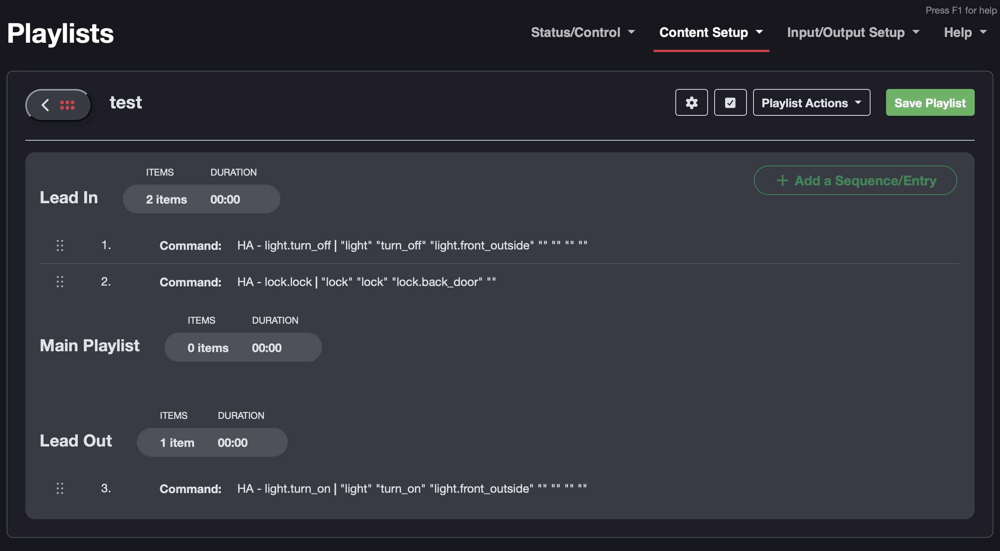
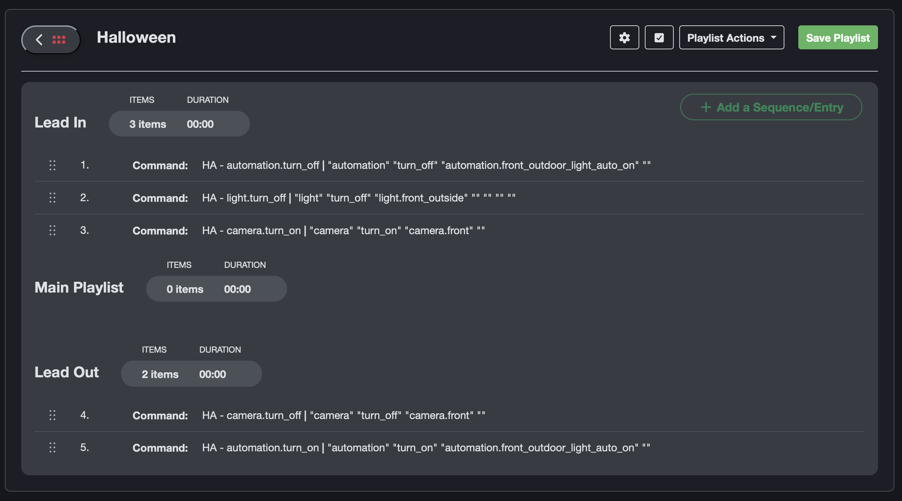

#  Home Assistant Commands Plugin for FPP (fpp-haCommands)

> **An FPP plugin that brings Home Assistant entities and actions into FPP as commands with entity dropdowns that can be used in playlists, scheduler, GPIO's, and xLights Sequences.**

## Requirements

#### For FPP commands, scheduler, playlists, and GPIO's
 - [x] FPP (8+)
 - [x] Home Assistant (2018.09+)
 - [x] HA Long-Lived Access Token (Profile > Security Tab > Long-Lived Access Token)
 - [x] Network connectivity between FPP and HA

#### For triggering devices with xLights Sequences
- [x] xLights (2024.14+)
- [x] Command Presets configured in FPP for any commands you want to call in a sequence

## Installation

### Plugin Manager (Recommended)

1. In FPP UI, go to **Content Setup → Plugin Manager**
2. Look for "Home Assistant Commands Plugin for FPP" in the list of plugins and click Install

Additionally this plugin can be installed with the following JSON URL:
   ```
   https://raw.githubusercontent.com/jessica12ryan/fpp-haCommands/main/pluginInfo.json
   ```

## Configuration

1. Go to **Content Setup → HA Commands**
2. Enter your **Home Assistant URL** (e.g. `http://your-ha-ip:8123`)
3. Enter a **Long-Lived Access Token** (generate in HA UI under your profile → Long-Lived Access Tokens)
4. Click **Test Connection** to verify
5. Click **Update Entities** to discover your HA entities and generate commands

## Usage

After running **Update Entities**, FPPD restarts and new commands appear in the playlist editor under the **Command** dropdown:

- `HA - <domain>.<action>` — Call any HA action (e.g. `light.turn_on`, `switch.turn_off`)
- `HA - Get State` — Fetch and log an entity's state

Each action command shows fields for selecting an entity and optional action parameters specific to the domain.

<details>
  <summary>Show/Hide Extra Fields</summary>

| Domain | Extra Fields |
|--------|-------------|
| `light` | Brightness %, RGB Color (r,g,b), Color Temp (mireds) |
| `cover` | Position % |
| `climate` | Temperature, HVAC Mode, Target Temp Low/High |
| `fan` | Speed, Direction |
| `media_player` | Volume (0.0-1.0), Source |
| `vacuum` | Command |
| `water_heater` | Temperature |
| `humidifier` | Humidity (0-100) |
| `scene` | Transition (seconds) — on *turn_on* only |
| `alarm_control_panel` | Code — on arm/disarm actions |
| `lock` | Code |
| `number` / `input_number` | Value |
| `select` / `input_select` | Option — on *select_option* only |
| `siren` | Tone, Volume (0.0-1.0), Duration (seconds) |
| `time` | Time (HH:MM:SS) |
| `timer` | Duration (HH:MM:SS or seconds) — on *start* and *change* |
| `notify` | Message, Title |
| `tts` | Message, Language |
| `remote` | Command, Device, Repeat Count |
| All others | Extra JSON field for any additional data |
</details>

Fields are only shown on actions that support them (e.g. `scene.reload` gets no extra fields, `number.increment` has no value field).

### Using HA Commands in an xLights Sequence (Frame-Accurate)

You can fire HA commands at specific frames *during* a sequence using xLights' built-in **FPP Commands** timing track and FPP **Command Presets**.

#### Step 1: Create FPP Command Presets

In FPP UI, go to **Commands → Command Presets** and create a preset for each HA action:

| Setting | Example |
|---|---|
| **Preset Name** | `Porch Lights On` (use this name in xLights later) |
| **Action** | Select `HA - light.turn_on` from the command dropdown |
| **entity_id** | `light.porch` |
| **brightness_pct** | `80` |

Repeat for each HA action you want to trigger (e.g., "Party Scene", "Garage Open", etc.).

> **Tip:** To trigger multiple home assistant devices at the same time, create an automation/script in Home Assistant, and trigger the entire automation or script with the command preset.

#### Step 2: Add an FPP Commands Timing Track in xLights

In xLights sequence editor:

1. **Right-click** on the timing tracks area (left of the timeline) → **Add Timing Track**
2. Set the track **Type** to **FPP Commands**

#### Step 3: Place Command Markers

1. Select where you want to place timing markers and press "t". You can create multiple timing markers and adjust when they trigger.
2. Shift + Double Click on your timing marks, enter the **exact name** of the FPP Command Preset you created in Step 1 (e.g., `Porch Lights On`)
3. Repeat for every HA timing track in your sequence

> **Tip:** Use xLights' **Timing Mark Grid** to snap commands to beats or time signatures for musical synchronization.

#### Step 4: Export and Upload

1. **Render** the sequence in xLights (this embeds the commands into the FSEQ file)
2. **Upload** the sequence to FPP via FPP Connect or manual file transfer
3. Add the sequence to an FPP playlist and play it

### Screenshots





## Troubleshooting

Check the plugin log after running a command:
```bash
tail -20 /home/fpp/media/logs/plugin-fpp-haCommands.log
```

Check FPPD logs for plugin errors:
```bash
grep -i "plugin-fpp-haCommands" /home/fpp/media/logs/plugin-fpp-haCommands.log | tail -20
```

## 📄 License

This repository is MIT licensed. FPP and Home Assistant are licensed under its own terms — see [FalconChristmas/fpp](https://github.com/FalconChristmas/fpp) and [home-assistant/core](https://github.com/home-assistant/core).
